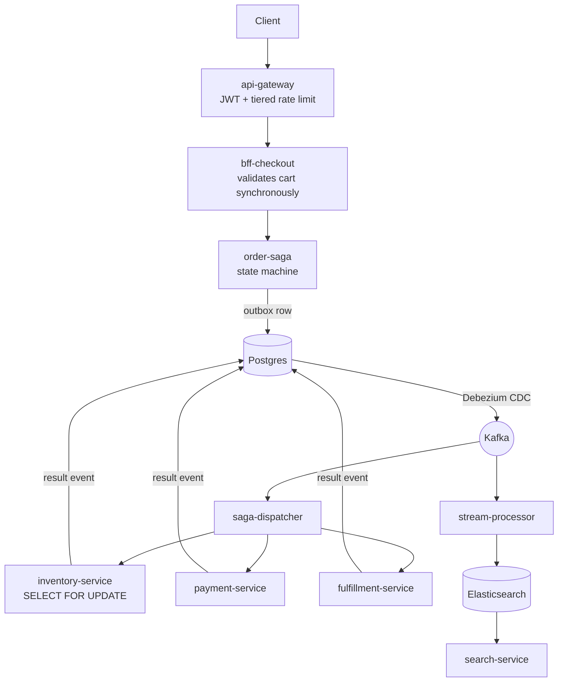

# E-Commerce Microservices Platform

An event-driven commerce backend built to explore the problems that only appear
under concurrency: overselling, double checkout, duplicate charges, lost carts,
and sagas that strand an order halfway through. Twenty services and seven workers
communicate through a transactional outbox and Kafka, orchestrated by an
explicit saga state machine with compensation for every step that moves money
or stock.

It runs on Docker Compose or Kubernetes, and the same end-to-end suite verifies
either one.

## Status

This repository documents what is built, not what is planned.

| | Count | |
|---|---|---|
| Services | 20 | all carry substantive logic |
| Workers | 7 | `saga-dispatcher`, `stream-processor`, `cdc-outbox`, `notification-worker`, `reindex-worker`, `webhook-handler`, `dlq-reprocessor` |
| Kubernetes manifests | 32 | generated from compose, never hand-edited |

"Built" means the code is there and does its job; it does not mean every path
is proven. The parts genuinely under test are the ones that were hard to get
right, and they are hard for the same reason each time — they only misbehave
under concurrency or failure:

- inventory reservation and the cart checkout mutex
- saga transitions, and payment charge and refund decisions
- gateway rate limiting, and cart cache coherence
- media quarantine, audit chain integrity, webhook deduplication, notification
  retry policy, DLQ recovery, and reindex field ownership

Two external boundaries are stubs, and deliberately so: there is no email, SMS
or push provider and no payment processor in this stack. `notification-worker`
and `webhook-handler` implement the logic and the tests around those edges, with
an interface where the third party would be. Everything outside the list above
is best read as working-but-unproven.

## Running it

Requires Docker with about 8 GB available. The stack is 34 containers, five of
them JVMs, so it does not comfortably share a machine with anything large.

```bash
cp .env.example .env      # then set JWT_SECRET and PSP_WEBHOOK_SECRET
docker compose -f docker-compose.yml -f docker-compose.apps.yml up -d
python scripts/bootstrap_schema.py
python fix_connectors.py
```

`make init` does all of the above in the right order, waits included — if you
have `make`. The ordering is not incidental: Debezium can only capture tables
that already exist, so connectors must be registered after the schema.

Verify it actually works:

```bash
python tests/e2e/run_suite.py
```

## Testing

Three tiers, deliberately separated by what they need to run.

| Tier | What it proves | Needs | Count |
|---|---|---|---|
| `tests/unit` | Decisions, against fake inputs and fake clocks | nothing | 322 |
| `services/api-gateway/test` | Rate limit tiering and exemptions | nothing | 24 |
| `tests/integration` | Behaviour under real parallel load | running stack | 4 |
| `tests/e2e` | The platform end to end | running stack | 7 |

```bash
python -m pytest tests/unit -q
cd services/api-gateway && npm test
python tests/e2e/run_suite.py
```

The integration checks need curl inside the mesh and are invoked slightly
differently per shell — see [tests/integration/README.md](tests/integration/README.md).

The split exists because a unit test cannot prove mutual exclusion and a
contention test cannot pin arithmetic. Each concurrency mechanism has both: unit
tests fix the decision, then a script fires N genuinely parallel requests and
asserts the invariant. That pairing is what caught the lock convoy that turned a
flash sale into a 500 storm, and the cache eviction that deleted carts.

## Continuous integration

Two workflows, in [.github/workflows](.github/workflows):

- **CI** — both unit tiers, on every push and pull request. ~15 seconds.
- **Stack tests** — boots a six-container slice (postgres, redis, cart-service,
  inventory-service, api-gateway, audit-service) and runs the cart cache e2e
  test plus all four concurrency checks. ~1m30s.

`test_01` through `test_06` are not in CI. They drive the CQRS pipeline and the
saga, so they need most of the platform, and a GitHub-hosted runner on a private
repository is 2 cores and 8 GB. Run them by hand after touching those paths.

## How a checkout flows



No service publishes to Kafka directly. Business state and the outbox row are
written in one transaction, and Debezium turns that into an event — so an event
cannot exist for a write that rolled back, and a write cannot silently fail to
announce itself.

The saga never rests in a failure state: `FAILED` and `TIMED_OUT` both converge
on `ROLLBACK_COMPLETED`, and every forward step declares its inverse. A
compensation for a step that never took effect must succeed as a no-op, because
after a timeout it is unknowable whether the charge went through.

## Layout

```
services/           20 services (Python/FastAPI, Node/Express at the edge)
workers/            Kafka consumers and the CDC connector registration
shared/libs/        Cross-service Python and Node libraries
migrations/         Numbered SQL, applied per-database
scripts/            Schema bootstrap, Kubernetes generation
infrastructure/k8s/ Generated manifests — regenerate, do not hand-edit
tests/              unit | integration | e2e
```

## Rules that shape the code

The full set is in [ARCHITECTURE_STATE_FINAL.md](ARCHITECTURE_STATE_FINAL.md).
The ones that come up constantly:

1. **No shared databases.** Every service owns its schema; no cross-database
   queries.
2. **Outbox before Kafka.** Never publish directly.
3. **Idempotency is mandatory.** A repeated `Idempotency-Key` returns the
   original result with its original status — never a `409`. The guard is a
   cache, not a gate.
4. **Compensation, not rollback.** A saga step without a defined inverse may not
   be added.
5. **Integer cents.** No binary floating point for money, anywhere.
6. **No secret fallbacks.** A service without its `JWT_SECRET` crashes on
   startup rather than running on a default.

## Documentation

- [ARCHITECTURE_STATE_FINAL.md](ARCHITECTURE_STATE_FINAL.md) — services, rules,
  saga vocabulary, DLQ policy
- [mermaid_architecture.md](mermaid_architecture.md) — full diagrams
- [tests/e2e/README.md](tests/e2e/README.md) — targeting compose vs Kubernetes
- [tests/integration/README.md](tests/integration/README.md) — running the
  contention checks
- [infrastructure/k8s/README.md](infrastructure/k8s/README.md) — cluster deploy
