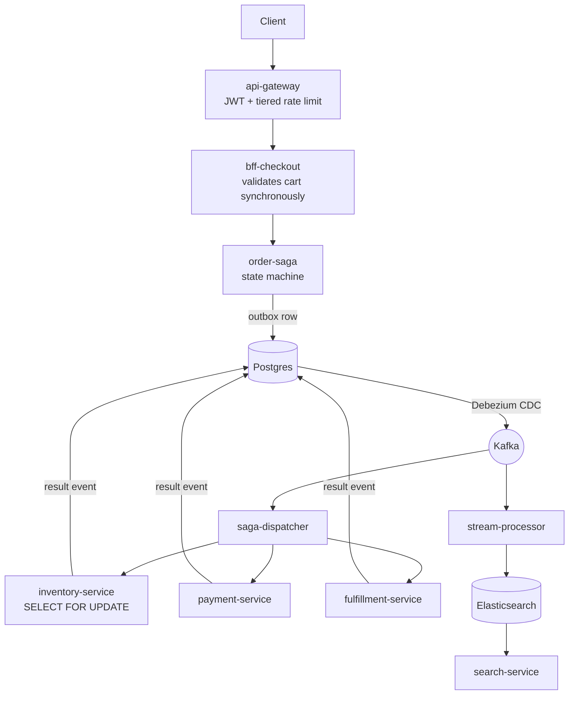

# E-Commerce Microservices Platform

An event-driven commerce backend built to explore the problems that only appear
under concurrency: overselling, double checkout, duplicate charges, lost carts,
and sagas that strand an order halfway through. Twenty services and six workers
communicate through a transactional outbox and Kafka, orchestrated by an
explicit saga state machine with compensation for every step that moves money
or stock.

It runs on Docker Compose or Kubernetes, and the same end-to-end suite verifies
either one.

## Status

This repository documents what is built, not what is planned.

| | Count | |
|---|---|---|
| Services | 20 | all carry substantive logic |
| Workers | 6 | `saga-dispatcher`, `stream-processor`, `notification-worker`, `reindex-worker`, `webhook-handler`, `dlq-reprocessor` — the six §3b names, all implemented |
| Kubernetes manifests | 32 | generated from compose, never hand-edited |

"Built" means the code is there and does its job; it does not mean every path
is proven. The parts genuinely under test are the ones that were hard to get
right, and they are hard for the same reason each time — they only misbehave
under concurrency or failure:

- inventory reservation and the cart checkout mutex
- saga transitions, and payment charge and refund decisions
- gateway rate limiting, and what survives losing Redis: a cart rehydrates
  from Postgres, a rate-limit budget cannot
- media quarantine, audit chain integrity, webhook deduplication, notification
  retry policy, DLQ recovery, and reindex field ownership
- CDC connector configuration: slot uniqueness, the event-type header, and
  capturing nothing but the outbox

Two external boundaries are stubs, and deliberately so: there is no email, SMS
or push provider and no payment processor in this stack. `notification-worker`
and `webhook-handler` implement the logic and the tests around those edges, with
an interface where the third party would be. Everything outside the list above
is best read as working-but-unproven.

## Running it

Requires Docker with about 8 GB available. The stack is 34 containers, five of
them JVMs, so it does not comfortably share a machine with anything large.

```bash
cp .env.example .env      # then set JWT_SECRET and PSP_WEBHOOK_SECRET
docker compose -f docker-compose.yml -f docker-compose.apps.yml up -d
python scripts/bootstrap_schema.py
python fix_connectors.py
```

`make init` does all of the above in the right order, waits included — if you
have `make`. The ordering is not incidental: Debezium can only capture tables
that already exist, so connectors must be registered after the schema.

Verify it actually works:

```bash
python tests/e2e/run_suite.py
```

## Testing

Three tiers, deliberately separated by what they need to run.

| Tier | What it proves | Needs | Count |
|---|---|---|---|
| `tests/unit` | Decisions, against fake inputs and fake clocks | nothing | 441 |
| `services/api-gateway/test` | Rate limit tiering and exemptions | nothing | 24 |
| `shared/libs/node-common/test` | Read-model field ownership, Node side | nothing | 18 |
| `tests/integration` | Behaviour under real parallel load | running stack | 4 |
| `tests/e2e` | The platform end to end | running stack | 8 |

```bash
python -m pytest tests/unit -q
```

```bash
cd services/api-gateway && npm test
```

```bash
cd shared/libs/node-common && npm test
```

```bash
python tests/e2e/run_suite.py
```

The integration checks need curl inside the mesh and are invoked slightly
differently per shell — see [tests/integration/README.md](tests/integration/README.md).

The split exists because a unit test cannot prove mutual exclusion and a
contention test cannot pin arithmetic. Each concurrency mechanism has both: unit
tests fix the decision, then a script fires N genuinely parallel requests and
asserts the invariant. That pairing is what caught the lock convoy that turned a
flash sale into a 500 storm, and the cache eviction that deleted carts.

## Continuous integration

Two workflows, in [.github/workflows](.github/workflows):

- **CI** — all three dependency-free tiers (Python units, the gateway's, and the
  shared Node library's), on every push and pull request. ~15 seconds.
- **Stack tests** — boots a six-container slice (postgres, redis, cart-service,
  inventory-service, api-gateway, audit-service) and runs the two state-loss
  e2e tests plus all four concurrency checks. ~1m40s.

`test_01` through `test_06` are not in CI. They drive the CQRS pipeline and the
saga, so they need most of the platform, and a GitHub-hosted runner on a private
repository is 2 cores and 8 GB. Run them by hand after touching those paths.

## How a checkout flows



No service publishes to Kafka directly. Business state and the outbox row are
written in one transaction, and Debezium turns that into an event — so an event
cannot exist for a write that rolled back, and a write cannot silently fail to
announce itself.

The saga never rests in a failure state: `FAILED` and `TIMED_OUT` both converge
on `ROLLBACK_COMPLETED`, and every forward step declares its inverse. A
compensation for a step that never took effect must succeed as a no-op, because
after a timeout it is unknowable whether the charge went through.

## How events reach the consumers

Every service writes business state and an `outbox_messages` row in one
transaction. Debezium tails each database's write-ahead log, and the outbox
event router turns those rows into Kafka messages routed by `aggregate_type`,
so a row tagged `Product` lands on `Product.events`.

One connector per service database, each with **its own replication slot**.
Postgres allows one connector per slot name, so connectors that share one fight
over it and some databases silently stop producing events. Every slot is named
after its service, and a test asserts no two are alike.

The event's type travels as a **Kafka header**, `eventType`, taken from the
outbox row's `type` column:

```
id:4cc1484d-…,timestamp:2026-08-16T21:09:11Z,eventType:InventoryReserved
```

It is a header rather than a field in the message because the value is Avro and
the Schema Registry runs `FULL_TRANSITIVE` (Rule 5). Adding a field to the value
is rejected outright — `Schema being registered is incompatible with an earlier
schema` — and the connector task fails. A header costs no schema version.

That header exists because the alternative was guessing. Before it, consumers
inferred an event's type from the shape of its fields, and the inference ended
in a fallback that assumed anything unrecognised was a product. A failed
inventory reservation matched nothing, so every one of them was indexed as a
product with a null name, a null SKU, and the inventory row's id. Nothing
failed; search hid them because it requires the catalog marker. Consumers now
refuse to guess: an unidentifiable event is skipped and logged, never assumed.

Shape checks remain as a fallback, because every event already on a topic was
published before the header existed and still has to be identified when a
consumer replays from the beginning.

Connectors are provisioned by one script and only one:

```bash
python fix_connectors.py
```

It is idempotent, and the configuration it builds is unit tested — slot
uniqueness, the type header, and that only `public.outbox_messages` is
captured. Capturing business tables would put private data on Kafka and defeat
the point of the outbox. A second set of hand-written connector definitions used
to live alongside it, covering eight of the fifteen databases and setting no
slot name at all; it is gone.

## Who owns what in the read model

The `products` document in Elasticsearch is assembled from three services, and
each field has exactly one writer:

| Field | Owner |
|---|---|
| `product_id`, `sku`, `name`, `description`, `is_active`, `base_price_cents` | catalog-service |
| `price_cents` | pricing-service |
| `quantity_available` | inventory-service |
| `updated_at` | nobody — every writer touches it |

Two prices, on purpose. `base_price_cents` is catalog's list price;
`price_cents` is the effective price pricing publishes. They were the same field
with two claimants for most of this project's life, which meant whoever wrote
last won and a product with no pricing row was served at `0` — displayed as free.
Search resolves them at read time, pricing first, and reports which it used.
An unpriced product returns `null`, never `0`, because the difference between
"free" and "we do not know yet" is the difference between a bug report and an
order.

Writes go through `read_model.write_product` in `python-common`, or
`writeProduct` in `node-common`. They are always a partial upsert and they
refuse fields the calling service does not own. That is not style. The same
whole-document write was made three separate times here — an e2e helper that
`PUT` documents and stripped every SKU on every run, a backfill worker that came
one line from erasing every price, and the CDC consumer that actually did erase
price and stock whenever Kafka redelivered a `ProductCreated`. Each was written
by someone who knew the document had several owners; knowing was not enough,
because the dangerous call is shorter to type. There is deliberately no function
that replaces a document, and a test asserts none appears.

A document without catalog's fields is not a product. Price and inventory events
index with `doc_as_upsert`, so an event arriving before its `ProductCreated`
creates a partial document rather than being dropped — correct for out-of-order
delivery — and search excludes it until catalog catches up.

Documents that stay parentless are deleted by `reindex-worker`, but only on
request (`REAP_ORPHANS`) and only after a grace period, since a partial document
and an early one look identical until enough time has passed. Three checks run
before any delete: the index says there is no catalog data, the document is
older than the grace period, and catalog is asked directly whether the row
exists. Only the last is authoritative.

The two ownership tables are separate files, because the libraries land in
different images and share no path at runtime. A parity test parses the
JavaScript and fails if the two ever disagree.

## Layout

```
services/           20 services (Python/FastAPI, Node/Express at the edge)
workers/            Kafka consumers and pollers
shared/libs/        Cross-service Python and Node libraries
migrations/         Numbered SQL, applied per-database
scripts/            Schema bootstrap, Kubernetes generation
infrastructure/k8s/ Generated manifests — regenerate, do not hand-edit
tests/              unit | integration | e2e
```

## Rules that shape the code

The full set is in [ARCHITECTURE_STATE_FINAL.md](ARCHITECTURE_STATE_FINAL.md).
The ones that come up constantly:

1. **No shared databases.** Every service owns its schema; no cross-database
   queries.
2. **Outbox before Kafka.** Never publish directly.
3. **Idempotency is mandatory.** A repeated `Idempotency-Key` returns the
   original result with its original status — never a `409`. The guard is a
   cache, not a gate.
4. **Compensation, not rollback.** A saga step without a defined inverse may not
   be added.
5. **Integer cents.** No binary floating point for money, anywhere.
6. **No secret fallbacks.** A service without its `JWT_SECRET` crashes on
   startup rather than running on a default.
7. **One writer per read-model field.** Shared documents are only ever written
   in parts, through the helper that enforces it. A whole-document write erases
   whatever the other owners put there.

## Documentation

- [MARKETPLACE_ROADMAP.md](MARKETPLACE_ROADMAP.md) — how this becomes a
  multi-vendor marketplace: the decisions to make first, and the phases
- [ARCHITECTURE_STATE_FINAL.md](ARCHITECTURE_STATE_FINAL.md) — services, rules,
  saga vocabulary, DLQ policy
- [mermaid_architecture.md](mermaid_architecture.md) — full diagrams
- [tests/e2e/README.md](tests/e2e/README.md) — targeting compose vs Kubernetes
- [tests/integration/README.md](tests/integration/README.md) — running the
  contention checks
- [infrastructure/k8s/README.md](infrastructure/k8s/README.md) — cluster deploy
